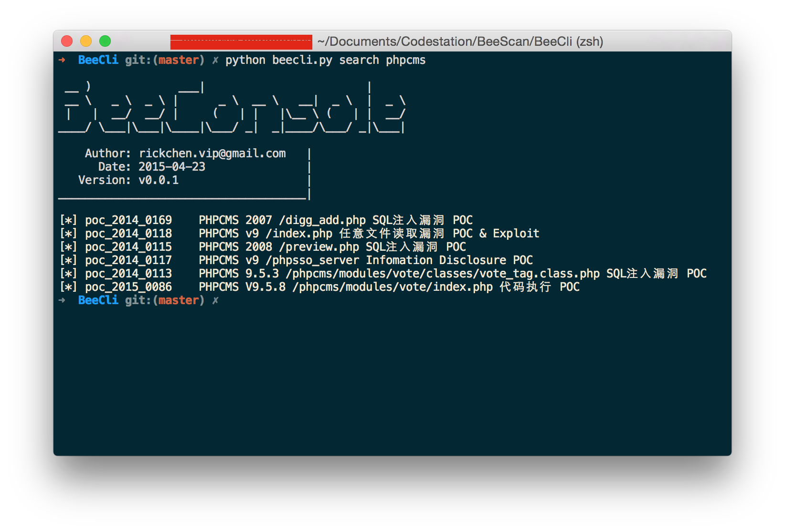
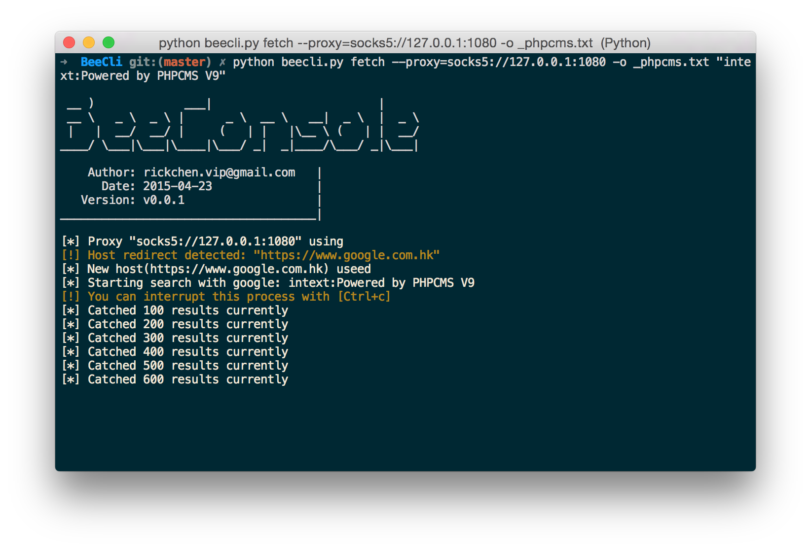
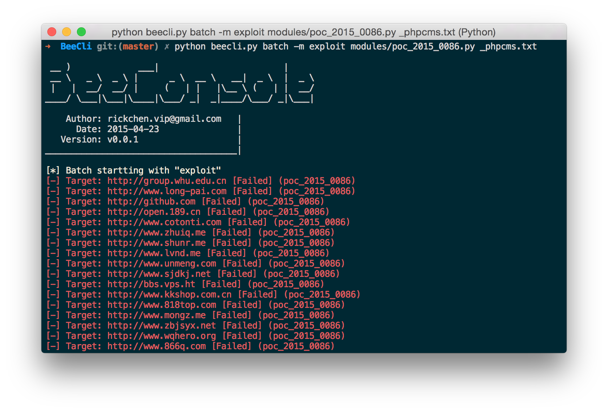

BeeCli
==

BeeCli是一款基于开源PoC框架[Beebeeto-framework](https://github.com/n0tr00t/Beebeeto-framework)进行开发的程序，它集PoC下载，本地PoC搜索、目标抓取、批量扫描等功能于一身。你还可以通过[Beebeeto-framework](https://github.com/n0tr00t/Beebeeto-framework)编写自己的PoC进行批量测试。

使用BeeCli可以很方便的对本地PoC模块进行搜索，通过Google Hacking语法批量抓取测试目标，并调用扫描功能对测试目标进行批量测试或者攻击。

### Installation
--

克隆BeeCli项目到本地:

	git clone https://github.com/RickGray/BeeCli.git BeeCli
	
安装所需的第三方Python库:

	termcolor
	simplejson
	requests
	lxml
	threadpool
	gevent
	PySocks
	
你可以通过`pip install -r requirements.txt`来安装这些依赖。

### Usage
--

目前BeeCli仅提供命令行调用的方式，共有四个功能模块`download(PoC下载）`，`search(本地搜索)`，`fetch(目标抓取)`和`batch(批量扫描)`。

	➜  BeeCli git:(master) ✗ python beecli.py -h

	 __ )             ___|                        |
	 __ \   _ \  _ \ |      _ \  __ \   __|  _ \  |  _ \
	 |   |  __/  __/ |     (   | |   |\__ \ (   | |  __/
	____/ \___|\___|\____|\___/ _|  _|____/\___/ _|\___|

	    Author: rickchen.vip@gmail.com   |
	      Date: 2015-04-23               |
	   Version: v0.0.1                   |
	_____________________________________|

	usage: beecli.py [-h] {download,search,fetch,batch} ...

	positional arguments:
	  {download,search,fetch,batch}
	                        sub-command help
	    download            download poc from beebeeto.com
	    search              search poc you want with some keyword
	    fetch               fetch targets from google or other search engine
	    batch               batch scan with file include targets

	optional arguments:
	  -h, --help            show this help message and exit

你可以通过`python beecli.py <sub-command> -h`的方式来查看相关功能模块的详细帮助。

通过[BeeBeeto](http://beebeeto.com)下载公开的PoC，将其放至`modules/`目录中以方便本地搜索和批量扫描使用。（或者使用内置命令`python beecli.py download`来进行下载）

如果需要编写自己的PoC，请参考编写[文档](http://docs.beebeeto.com/)。

### Screenshot

PoC搜索:

通过Google Hacking批量抓取测试目标:

批量检测:

